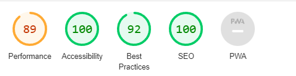

## **How to run**
npm install and then npm start.

A live version can be found <a href="https://react-countries-challenge.herokuapp.com/" target="_blank">here</a>

## **Testing**

### **Lighthouse**
Lighouse testing was complete for the home page and the results were as follows:

<h2 align=center id="top"></h2>

### **Responsiveness testing**

Extensive manual testing was completed to ensure that each page is fully responsive.Below is a sample of what the home page will look like on different devices

<h2 align=center id="top"></h2>